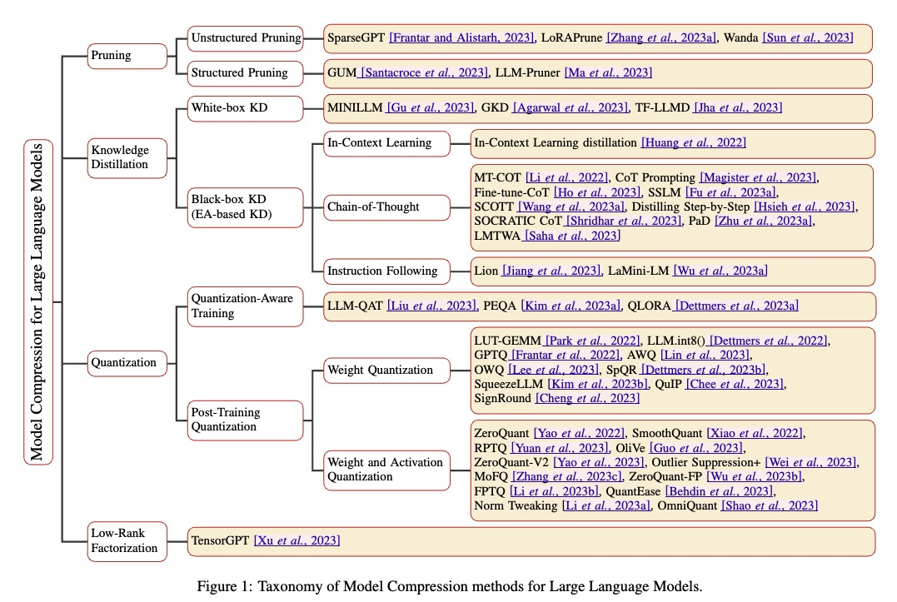

# 大規模言語モデルの圧縮手法

[[2023] A Survey on Model Compression for Large Language Models](https://arxiv.org/abs/2308.07633)より

- **Pruning; 枝刈り**
  - Unstructured Pruning; 非構造化枝刈り
    - SparseGPT [Frantar and Alistarh, 2023], LoRAPrune [Zhang et al., 2023a], Wanda [Sun et al., 2023]
  - Structured Pruning; 構造化枝刈り
    - GUM [Santacroce et al., 2023], LLM-Pruner [Ma et al., 2023]

- **Knowledge Distillation; 知識蒸留**
  - White-box KD; ホワイトボックス蒸留
    - MINILM [Gu et al., 2023], GKD [Agarwal et al., 2023], TF-LLMD [Jha et al., 2023]
  - Black-box KD (EA-based KD); ブラックボックス蒸留（EAベース蒸留）
    - MT-CoT [Li et al., 2022], CoT Prompting [Magister et al., 2023], Fine-tune-CoT [Ho et al., 2023], SSLM [Hu et al., 2023]
    - SCOTT [Wang et al., 2023], Distilling Step-by-Step [Hsieh et al., 2023]
    - SOCRATIC CoT [Ishihara et al., 2023], PaD [Zhu et al., 2023], LMTWA [Saha et al., 2023]
  - Instruction Following; 命令フォロー
    - Lion [Jiang et al., 2023], LaMini-LM [Wu et al., 2023a]

- **Quantization; 量子化**
  - Quantization-Aware Training; 量子化対応トレーニング
    - LLM-QAT [Liu et al., 2023], PEQA [Kim et al., 2023a], QLORA [Dettmers et al., 2023a]
  - Post-Training Quantization; ポストトレーニング量子化
    - Weight Quantization; 重み量子化
      - LUT-GEMM [Park et al., 2022], LLM.int8() [Dettmers et al., 2022], GPTQ [Frantar et al., 2022], AWQ [Lin et al., 2023], OWQ [Lee et al., 2023], SpQR [Dettmers et al., 2023b], SqueezeLLM [Kim et al., 2023b], QuIP [Chee et al., 2023], SignRound [Cheng et al., 2023]
    - Weight and Activation Quantization; 重みとアクティベーション量子化
      - ZeroQuant [Yao et al., 2022], SmoothQuant [Xiao et al., 2022], PRTQ [Yuan et al., 2023], Olive [Gupta et al., 2023], ZeroQuant-V2 [Yao et al., 2023], Outlier Suppression [Wei et al., 2023], MoPQ [Zhang et al., 2023b], ZeroQuant-PF [Wu et al., 2023b], FPTQ [Li et al., 2023a], QuantEase [Bechdin et al., 2023], Norm Tweaking [Li et al., 2023b], OmniQuant [Shao et al., 2023]

- **Low-Rank Factorization; 低ランク因数分解**
  - TensorGPT [Xu et al., 2023]

